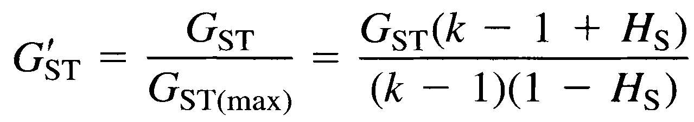

# G&prime;<sub>ST</sub>

The R code presented here calculates the G&prime;<sub>ST</sub> estimator used in:

Tumonggor MK, TM Karafet, B Hallmark, JS Lansing, H Sudoyo, MF Hammer and MP Cox. 2013. [The Indonesian archipelago: an ancient genetic highway linking Asia and the Pacific](https://doi.org/10.1038/jhg.2012.154). *Journal of Human Genetics* 58: 165-173.

Tumonggor MK, TM Karafet, S Downey, JS Lansing, P Norquest, H Sudoyo, MF Hammer and MP Cox. 2014. [Isolation, contact and social behavior shaped genetic diversity in West Timor](https://doi.org/10.1038/jhg.2014.62). *Journal of Human Genetics* 59: 494-503.

The G&prime;<sub>ST</sub> estimator was developed by:

Hedrick PW. 2005. [A standardized genetic differentiation measure](https://doi.org/10.1111/j.0014-3820.2005.tb01814.x). *Evolution* 59: 1633-1638.

Specifically, the code implements equation 4b in Hedrick (2005):



The [*gst_prime* function](gst_prime.R) is written in base R, and requires values for the number of subpopulations *k*, the average subpopulation heterozygosity *H<sub>S</sub>* and the total population heterozygosity *H<sub>T</sub>*.  Usage is:

gst_prime(*k*, *H<sub>S</sub>*, *H<sub>T</sub>*)

Worked example:

A study population containing 14 subpopulations with average subpopulation heterozygosity of 0.953 and total population heterozygosity of 0.981 would return:

```
gst_prime(14, 0.953, 0.981)
0.6518016
```
